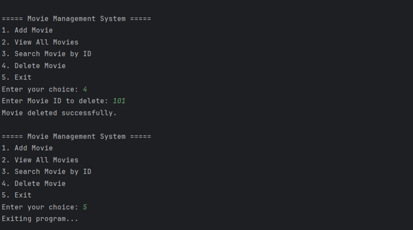

# Movie Management System (LinkedList)

A Java application demonstrating the use of LinkedList for managing movie records.

## Features

* Add Movie Records
* Display Records
* Sequential Data Management

## Concepts Used

* LinkedList
* Collections Framework
* Dynamic Data Storage

## How to Run

```bash
javac MovieManagementLinkedList.java
java MovieManagementLinkedList
```

## Output


