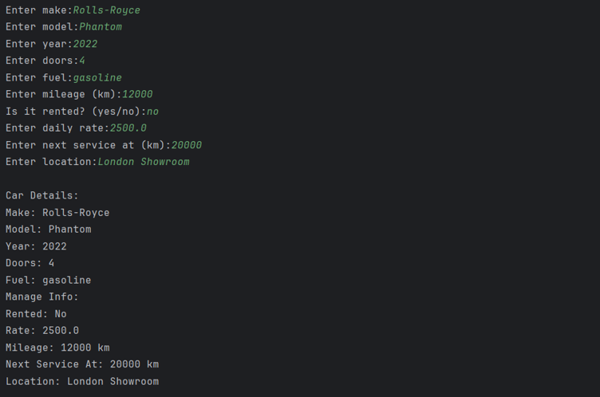
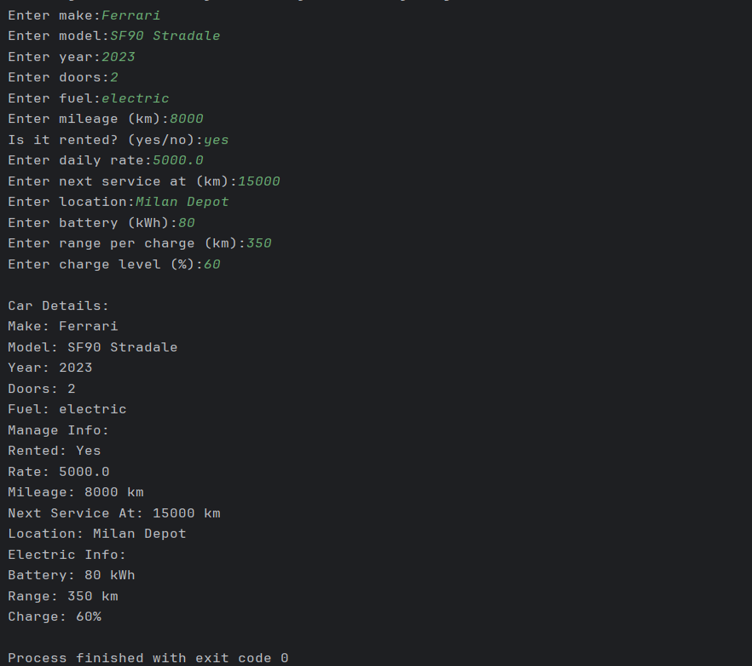

# Car Management System

A Java application demonstrating inheritance through vehicle and car management operations.

## Features

* Vehicle Information
* Car Details Management
* Inherited Properties and Methods

## Concepts Used

* Inheritance
* Classes and Objects
* Method Reuse

## How to Run

```bash
javac CarManagementSystem.java
java CarManagementSystem
```

## Output




